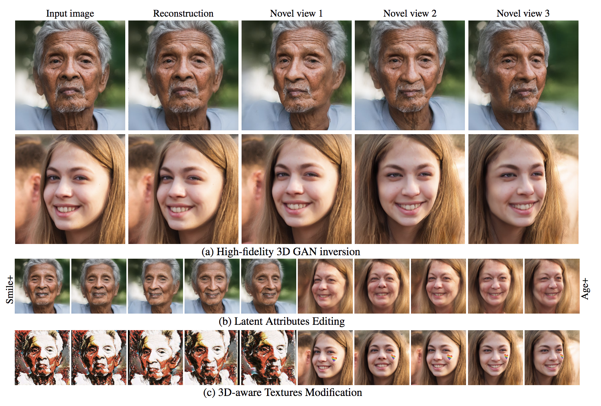
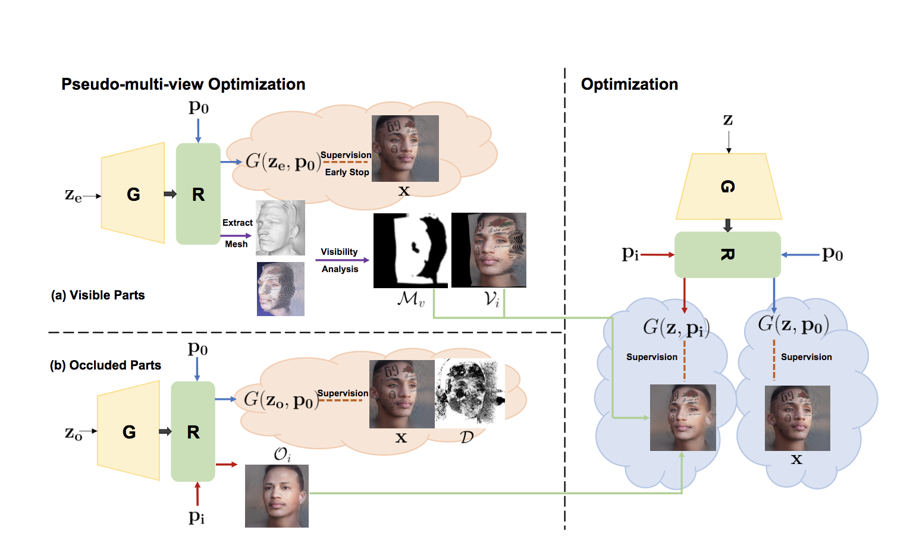

# High-fidelity 3D GAN Inversion by Pseudo-multi-view Optimization


[paper]() | [project website](https://ken-ouyang.github.io/HFGI3D/index.html)
  
 

## Introduction
We present a high-fidelity 3D generative adversarial net-
work (GAN) inversion framework that can synthesize photo-
realistic novel views while preserving specific details of the
input image.

  


## Set up
### Installation
```
git clone https://github.com/jiaxinxie97/HFGI3D.git
cd HFGI3D
```

### Environment

```
conda create -n HFGI3D python=3.7
conda activate HFGI3D
conda install pytorch torchvision torchaudio cudatoolkit=11.6 -c pytorch -c conda-forge
conda install -c fvcore -c iopath -c conda-forge fvcore iopath
conda install pytorch3d -c pytorch3d
pip install -r requirements.txt
```

## To Do
- [x] Release the pose estimation code for customized images
- [x] Release the editing code

## Quick Start

### Prepare Images
We put some examples images and their corresponding pose in `./test_imgs`, also we put the configs files of examples in `./example_configs/`, and you can quickly try them.   
For customized images, it is encouraged to first pre-process (align & crop) and extract pose for them, and then inverse and edit with our model. Code for this part will be released soon.

### Inference
  
```
cd inversion/scripts
python run_pti.py ../../example_configs/config_00001.py
```

## More Results
Video results are shown on our project website (https://ken-ouyang.github.io/HFGI3D/index.html).

## Citation
If you find this work useful for your research, please cite:


