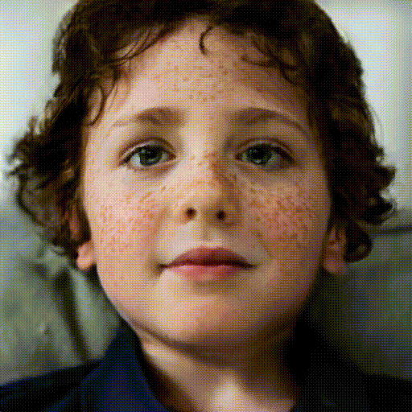
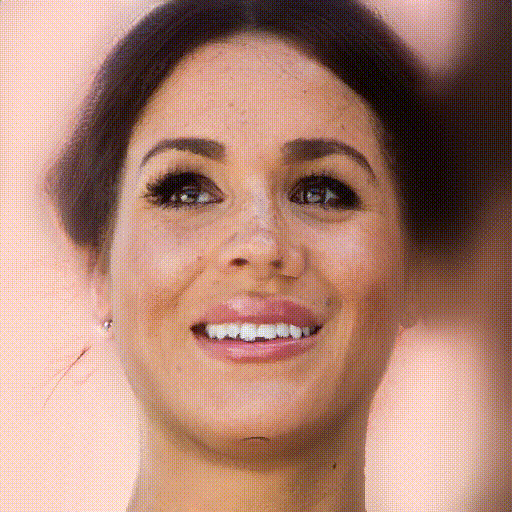

# High-fidelity 3D GAN Inversion by Pseudo-multi-view Optimization


[paper](https://arxiv.org/abs/2211.15662) | [project website](https://ken-ouyang.github.io/HFGI3D/index.html)
 
                   

                    

## Introduction
We present a high-fidelity 3D generative adversarial net-
work (GAN) inversion framework that can synthesize photo-
realistic novel views while preserving specific details of the
input image.

  


## Set up
### Installation
```
git clone https://github.com/jiaxinxie97/HFGI3D.git
cd HFGI3D
```

### Environment

```
conda env create -f environment.yml
conda activate HFGI3D
pip install -r pose_requirements.txt
```

## To Do
- [x] Release the editing code

## Quick Start

### Prepare Images
We put some examples images and their corresponding pose in `./test_imgs`, also we put the configs files of examples in `./example_configs/`, and you can quickly try them.   

For customized images, download the pretrained [pose estimation model](https://drive.google.com/file/d/1zawY7jYDJlUGnSAXn1pgIHgIvJpiSmj5/view?usp=sharing) and [BFM files](https://drive.google.com/file/d/1mdqkEUepHZROeOj99pXogAPJPqzBDN2G/view?usp=sharing), put `epoch_20.pth` in `./pose_estimation/checkpoints/pretrained/` and put unzip `BFM.zip` in `./pose_estimation/` 

```
cd inversion/pose_estimation
python extract_pose.py 0 custom_imgs_folder temp_folder output_folder

###example
#python extract_pose.py 0 ../custom_imgs ../align_imgs ../test_imgs

```
Then create config files for customized images in `./example_configs/`

### Pretraind model
Download the pretrained generator on FFHQ from [EG3D](https://github.com/NVlabs/eg3d). For convenience, we upload it in Google drive(https://drive.google.com/file/d/1rsF-IHBLW7WvDckdbNK9Qm9SwHK02E5l/view?usp=sharing). Download  `ffhq512-128.pkl` and put it in `./inversion/`.

### Optimization
  
```
cd inversion/scripts
python run_pti.py ../../example_configs/config_00001.py
```

For customized images,
```
cd inversion/scripts
python run_pti.py ../../example_configs/customized_config.py
```

### More Results
Video results are shown on our project website (https://ken-ouyang.github.io/HFGI3D/index.html).

### Acknowlegement   
We thank the authors of [EG3D](https://github.com/NVlabs/eg3d), [PTI](https://github.com/danielroich/PTI) and [Deep3DFaceRecon](https://github.com/sicxu/Deep3DFaceRecon_pytorch/tree/6ba3d22f84bf508f0dde002da8fff277196fef21) for sharing their code.

### Citation
If you find this work useful for your research, please cite:
```
@article{xie2022high,
  title={High-fidelity 3D GAN Inversion by Pseudo-multi-view Optimization},
  author={Xie, Jiaxin and Ouyang, Hao and Piao, Jingtan and Lei, Chenyang and Chen, Qifeng},
  journal={arXiv preprint arXiv:2211.15662},
  year={2022}
}
```


